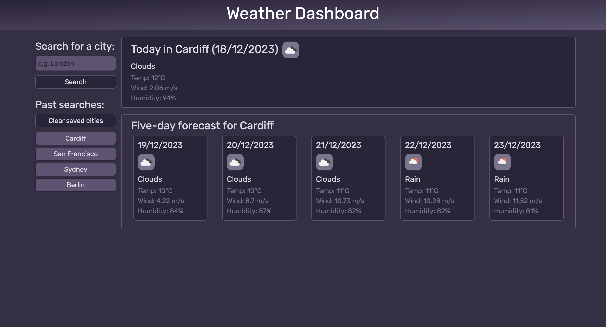

# weather-dashboard v1

## Description
An app to see current weather conditions in a chosen city, and to view the forecast for the upcoming five days.

### Project Deliverables
- Built dashboard components using Bootstrap and the basic HTML provided
- Created design using CSS
- Wrote JavaScript code to:
  - Call data from OpenWeatherMap APIs (one for today's data, one for five-day forecast)
  - Build section displaying today's weather data
  - Build cards displaying weather forecast - one for each of the upcoming five days
  - Build a sidebar to save past searches and buttons for each searched city
  - Recall searches from localstorage

## To Do
- Finish forloop to recall saved data after page closure/refresh
  - Need to save data as an object to prevent it calling the API every time
- Make code to add/subtract difference between searched city and UTC, so that data shows for the correct timezone

### Installation
No installation required.

### Usage
The webpage can be viewed at https://lico27.github.io/weather-dashboard and the JavaScript can be viewed in the repository at /assets/js/script.js.

- Type a city name into the search bar and click Search/press return
- Your past searches are saved in a list - click on a city name to recall the weather data for that city
  - The list becomes scrollable once enough cities are saved
- Click 'Clear saved cities' to delete past saves

### Screenshot

## Credits
JavaScript and CSS coded by Liam Cottrell. Basic HTML provided by edX Front-End Dev Bootcamp. 

## License
Produced under the MIT license.

## Badges

<!-- ## Badges
 -->